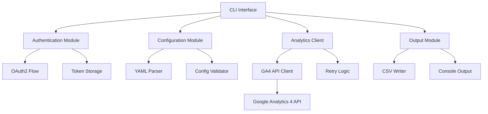

# 設計書

## 概要

Googlelytics 4 (GA4) トラッキングツールは、GoでCLIアプリケーションとして実装されます。OAuth認証、YAML設定ファイル処理、Google Analytics 4 API統合、CSV出力機能を提供し、Webサイトのトラッキングデータを効率的に取得・分析できるツールです。

## アーキテクチャ

### 全体アーキテクチャ



### レイヤー構造

1. **CLI Layer**: コマンドライン引数の処理とユーザーインターフェース
2. **Service Layer**: ビジネスロジックとワークフロー制御
3. **Client Layer**: 外部API（Google Analytics 4）との通信
4. **Infrastructure Layer**: 認証、設定、出力処理

## コンポーネントと インターフェース

### 1. CLI Interface (`cmd/ga/main.go`)

```go
type CLIApp struct {
    authService      AuthService
    configService    ConfigService
    analyticsService AnalyticsService
    outputService    OutputService
}

type Command struct {
    Name        string
    Description string
    Handler     func(args []string) error
}

type CLIOptions struct {
    ConfigPath  string
    OutputPath  string
    Debug       bool
    Help        bool
    Version     bool
    Login       bool
}
```

**責任:**
- コマンドライン引数の解析
- サブコマンド（--login, --help, --version, --config）の処理
- エラーハンドリングとユーザーフィードバック
- 適切な終了コードの管理

### 2. Authentication Service (`internal/auth/`)

```go
type AuthService interface {
    Login(ctx context.Context) error
    GetCredentials(ctx context.Context) (*oauth2.Token, error)
    RefreshToken(ctx context.Context) error
}

type OAuth2Config struct {
    ClientID     string
    ClientSecret string
    RedirectURL  string
    Scopes       []string
}
```

**責任:**
- OAuth2認証フローの管理
- トークンの保存と更新
- 認証状態の検証

### 3. Configuration Service (`internal/config/`)

```go
type ConfigService interface {
    LoadConfig(path string) (*Config, error)
    ValidateConfig(config *Config) error
}

type Config struct {
    StartDate   string     `yaml:"start_date"`
    EndDate     string     `yaml:"end_date"`
    Account     string     `yaml:"account"`
    Properties  []Property `yaml:"properties"`
}

type Property struct {
    ID      string   `yaml:"property"`
    Streams []Stream `yaml:"streams"`
}

type Stream struct {
    ID         string   `yaml:"stream"`
    Dimensions []string `yaml:"dimensions"`
    Metrics    []string `yaml:"metrics"`
}
```

**責任:**
- YAML設定ファイルの読み込み
- 設定値の検証
- デフォルト値の適用

### 4. Analytics Service (`internal/analytics/`)

```go
type AnalyticsService interface {
    GetReportData(ctx context.Context, config *Config) (*ReportData, error)
}

type GA4Client struct {
    service *analyticsreporting.Service
    config  *Config
}

type ReportData struct {
    Headers []string
    Rows    [][]string
    Summary ReportSummary
}

type ReportSummary struct {
    TotalRows    int
    DateRange    string
    Properties   []string
}
```

**責任:**
- Google Analytics 4 APIとの通信
- データ取得とフォーマット
- エラーハンドリングとリトライ

### 5. Output Service (`internal/output/`)

```go
type OutputService interface {
    WriteCSV(data *ReportData, writer io.Writer) error
    WriteToFile(data *ReportData, filename string) error
    WriteToConsole(data *ReportData) error
}

type CSVWriter struct {
    encoding string
    delimiter rune
}
```

**責任:**
- CSV形式でのデータ出力
- ファイル出力と標準出力の管理
- UTF-8エンコーディング処理

## データモデル

### 1. 設定データモデル

```yaml
# ga.yaml の構造
start_date: "2023-01-01"
end_date: "2023-01-31"
account: "123456789"
properties:
  - property: "987654321"
    streams:
      - stream: "1234567"
        dimensions:
          - "date"
          - "pagePath"
        metrics:
          - "sessions"
          - "activeUsers"
          - "newUsers"
          - "averageSessionDuration"
```

### 2. API レスポンスデータモデル

```go
type GAReportResponse struct {
    DimensionHeaders []DimensionHeader
    MetricHeaders    []MetricHeader
    Rows             []ReportRow
}

type ReportRow struct {
    Dimensions []string
    Metrics    []MetricValue
}

type MetricValue struct {
    Value string
}
```

### 3. CSV出力データモデル

```csv
date,pagePath,sessions,activeUsers,newUsers,averageSessionDuration
2023-01-01,/home,1250,1100,850,120.5
2023-01-01,/about,450,420,380,95.2
```

## エラーハンドリング

### エラー分類

1. **認証エラー**: OAuth認証失敗、トークン期限切れ
2. **設定エラー**: YAML形式エラー、必須項目不足
3. **APIエラー**: Google Analytics API制限、ネットワークエラー
4. **出力エラー**: ファイル書き込み権限、ディスク容量不足

### エラーハンドリング戦略

```go
type GAError struct {
    Type    ErrorType
    Message string
    Cause   error
}

type ErrorType int

const (
    AuthError ErrorType = iota
    ConfigError
    APIError
    OutputError
)

func (e *GAError) Error() string {
    return fmt.Sprintf("[%s] %s: %v", e.Type, e.Message, e.Cause)
}
```

### リトライ戦略

- **API制限エラー**: 指数バックオフで最大3回リトライ
- **ネットワークエラー**: 線形バックオフで最大5回リトライ
- **認証エラー**: 自動トークン更新を1回試行

## テスト戦略

### 1. 単体テスト

- **対象**: 各サービスとユーティリティ関数
- **モック**: Google Analytics API、ファイルシステム
- **カバレッジ**: 80%以上を目標

### 2. 統合テスト

- **対象**: サービス間の連携
- **テストデータ**: サンプルYAML設定ファイル
- **モック**: 外部API呼び出し

### 3. エンドツーエンドテスト

- **対象**: CLI全体のワークフロー
- **環境**: テスト用Google Analytics プロパティ
- **検証**: CSV出力の正確性

### テスト構造

```
tests/
├── unit/
│   ├── auth_test.go
│   ├── config_test.go
│   ├── analytics_test.go
│   └── output_test.go
├── integration/
│   ├── service_integration_test.go
│   └── api_integration_test.go
├── e2e/
│   └── cli_e2e_test.go
└── testdata/
    ├── valid_config.yaml
    ├── invalid_config.yaml
    └── sample_response.json
```

## セキュリティ考慮事項

### 1. 認証情報の保護

- OAuth2トークンの暗号化保存
- 設定ファイルでの平文パスワード禁止
- 環境変数での機密情報管理

### 2. API通信のセキュリティ

- HTTPS通信の強制
- TLS証明書の検証
- リクエスト/レスポンスのログ制限

### 3. ファイルアクセス制御

- 設定ファイルの適切な権限設定
- 出力ファイルの安全な作成
- 一時ファイルの適切な削除

## パフォーマンス考慮事項

### 1. API呼び出し最適化

- バッチリクエストの活用
- 並行処理での複数プロパティ取得
- キャッシュ機能（オプション）

### 2. メモリ使用量最適化

- ストリーミング処理でのCSV出力
- 大量データの分割処理
- ガベージコレクション最適化

### 3. 実行時間最適化

- 設定ファイルの事前検証
- 早期エラー検出
- プログレス表示機能